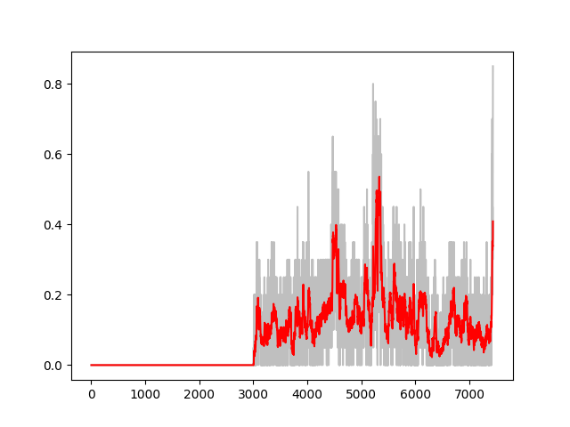

# q-learning

the main diffrent between q learning and value iteration is that we dont iterate over every step in the enviroment to get the value of the state, instead we just use the enviroment we have, we just get the tuple `(s,a,r,new_s)` , and from this whe update the value of state `s` using bellman equation, but we dont just override th previous valu, w use the `\theta` for update , 

this ofcourse will  take mor time to convrge compared to value iteration , but it is better than value iteration if our state space is higher for example 
a plot of the reward over diffrent iteration is as follows 

as you can see the training is not that stable but it will converge after some time 
